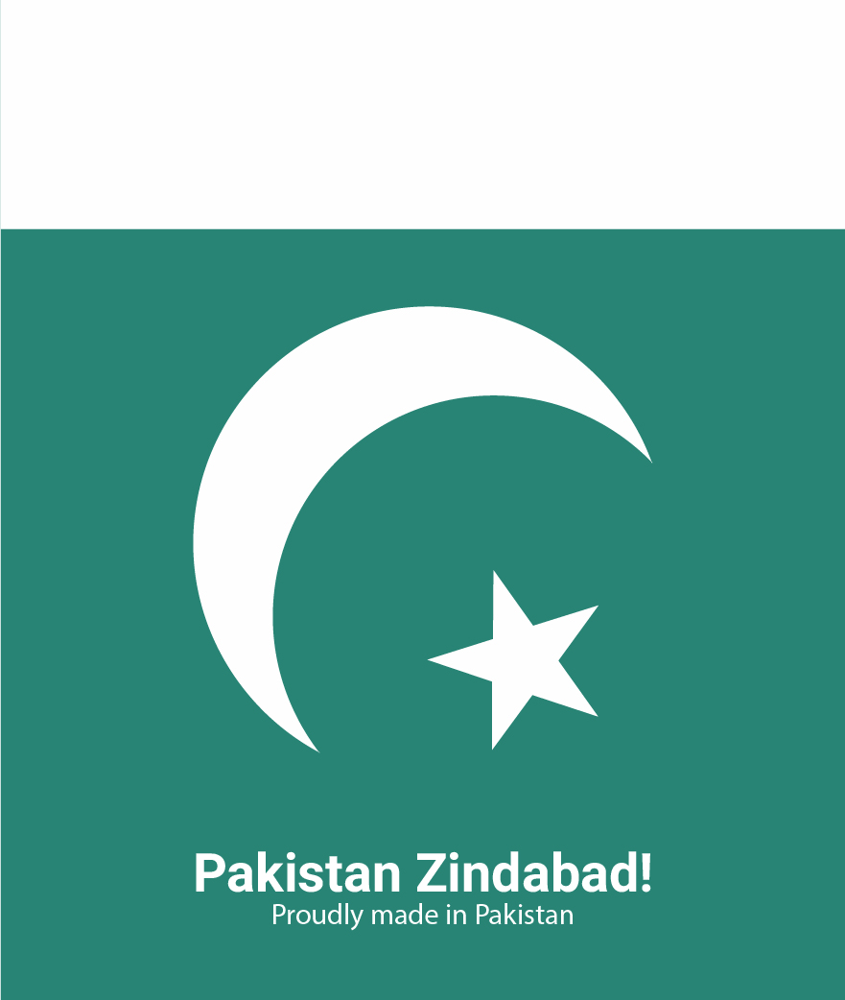

<h1 style="text-align:center;">A live wallpaper app to show the astonishing monuments of Pakistan</h1>

  

## About

Ever since we were young we saw that there was very little Pakistani content in the digital world. So we embarked on this journey to create as much content as we can in our free time!

### There are currently six live wallpaper of astonishing monuments in Pakistan:

    

    

### There are five variants of each six monuments which change with time

### Morning

    

### Afternoon

    

### Evening

    

### Night

    

### Night (dark version)

    

### All of the wallpapers were designed by <a href="u">Salman Afzal</a>.

## Note

We created Material Pakistan a while back, and our original plan was to keep this app updated, but due to high-demanding jobs, we couldn't :) So now I'm making the source code public. 

Anyone wants to use the code for learning purposes or to add more wallpapers, or just want to reuse the code. Please feel free to do so :)
